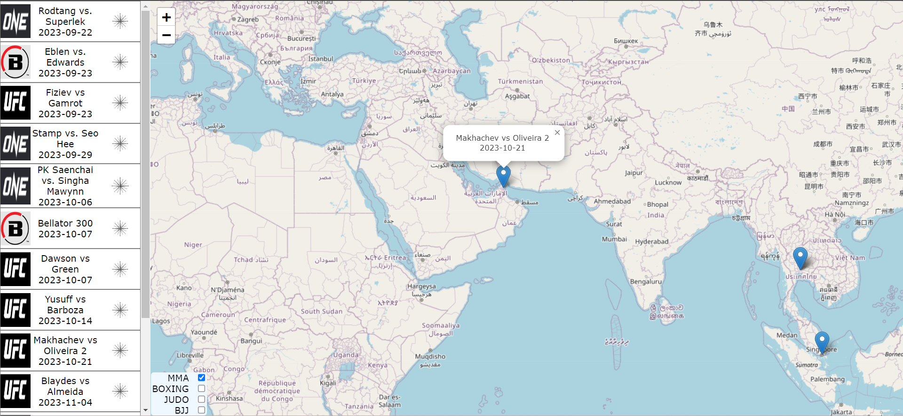

# MMA_MAPs 
MMA is a growing sport, and the scheduling/advertising is handleded poorly! 
MMA Maps serves as the go to hub for the average fight lover to keep up with the BIG FIGHTS happening around the world for JUST the mnajor organizations. Includes a sidebar with upcoming events along with a map featuring markers of where the fights are occuring in the world!

First major project I undertook to demonstrate understanding of the modern computer stack. 
Currently discontinued due to cost.

# AWS_Airflow_Webscraper
- Webscrapers that gathering fight schedule data from a variety of organizations in sports including: Boxing, BJJ, Judo, MMA. Webscrapers were written in Python using both the Beautiful Soup & Selenium libraries, which were triggered via a Airflow deployment (scheduled 1/week) hosted on an EC2 VM on Amazon Web Services (AWS). Data is stored on a Postgresql database hosted on Render.com. 

# Backend
- Rest API written in Python's Flask library, to provide an endpoint for the front-end React app to access fighting schedule data. Hosted on Render.com. 

# React_App
- Front-end website with a sidebar tracking fighting events from major organizations (curated by me). Includes a React-Leaflet map with markers indicating location of events around the world, with a check-box UI that dynamically filters events by sport. The events listed in the sidebar also includes a button, which refocuses the map to the event location. Hosted on Vercel.com 
